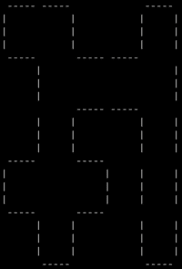

# Documentation

## Problem description

Slither Link is a Japanese logic puzzle. It is played on a board that consists of dots arranged into squares. The goal of the game is to connect adjacent dots in a such a way
that they form a singular loop with no loose ends. Inside each square there can be a number from 0 to 3 indicating
how many of the square's sides need to be included in the final loop.

## Encoding

### Variables

To encode this problem we will be using a single variable:

$Edge(x,y,orientation)$ is a boolean that indicates whether an edge is present in the loop
We need to specify whether an edge is vertical or horizontal otherwise we wouldn't be able to index them

This variable is crucial to determine which route our loop is taking - what edges are a part of it
Loading cell values (number constraints) from the input will determine which permutations of edges are valid
For example if a cell has the value 3 there are 4 combinations of edges with (3 true, 1 false) which are valid

### Constraints

Every vertex must have either 2 or no edges going through it - in any different case the loop would not adhere to the rules
We can apply this rule on our variable by saying that every true edge must have 2 adjacent true edges

#### Cell number constraint

If the cell has the value 1, exactly one edge is true:

1. At least one edge is true:

$$
e_1 \lor e_2 \lor e_3 \lor e_4
$$

2. At most one edge is true:

   for each pair:

$$
\neg e_i \lor \neg e_j
$$

If the cell has the value 3, the clauses are just mirrored (exactly one is false)

Finally, if the cell value is 2, exactly 2 edges are true which can be described as: At least two are true and At most two are true

#### Basic loop constraint

Every vertex must have either 2 or no edges going through it - in any different case the loop would not adhere to the rules
We can apply this rule on our variable by saying that every true edge must have 2 ad

1. At least one neighbor from each side is true if the original edge is true

2. At most one neighbor from each side is true if the original edge is true

The following formula is applied to both ends of the edge:

$$
\bigwedge_{1 \leq i \leq 3} \left( \neg e \lor n_1 \lor n_2 \lor n_3 \right)
\quad \bigwedge_{1 \leq i < j \leq 3} \left( \neg e \lor \neg n_i \lor \neg n_j \right)
$$

Some of the adjacent edges can be non-existent, in that case they are removed from the list of neigbors before the generation of clauses

### Output

The user will see all the edges drawn out (if a solution is possible)


### Problems

In its current state the encoding is not prohibiting the creation of multiple loops

It could be solved by introducing another variable called reachability and check if all true edges are reachable from all other true edges

However, despite many experiments I have not found a way to encode this into CNF

## User documentation

Basic usage:

```
slitherlink.py [-h] [-i INPUT] [-o OUTPUT] [-s SOLVER] [-v {0,1}]
```

Command-line options:

- `-h`, `--help` : Show a help message and exit.
- `-i INPUT`, `--input INPUT` : The instance file. Default: "input.in".
- `-o OUTPUT`, `--output OUTPUT` : Output file for the DIMACS format (i.e. the CNF formula).
- `-s SOLVER`, `--solver SOLVER` : The SAT solver to be used.
- `-v {0,1}`, `--verb {0,1}` : Verbosity of the SAT solver used.

## Example instances

- `input-elementary`: Smallest possible board
- `input-numbers`: Standard size puzzle - solvable
- `input-largeunsat`: Big, Unsolvable board
- `input-small-unsat`: Small number-populated Unsolvable board
- `input-hard-small`: Hard but solvable small board
- `input-medium`: Decent sized board with a solution

## Experiments

The experiments were run on an Apple M2 chip with 8 GB RAM on Mac OS X

No case that I have tested has resulted in the calculation time being longer than 0.01 s

Due to the nature of this problem the solver either quickly recognizes that some cell conditions overlap thus leading to UNSAT

And making large guaranteed solvable instances is way too difficult

Performance could be tested better if I had figured out how to enforce the one single loop condition during runtime
